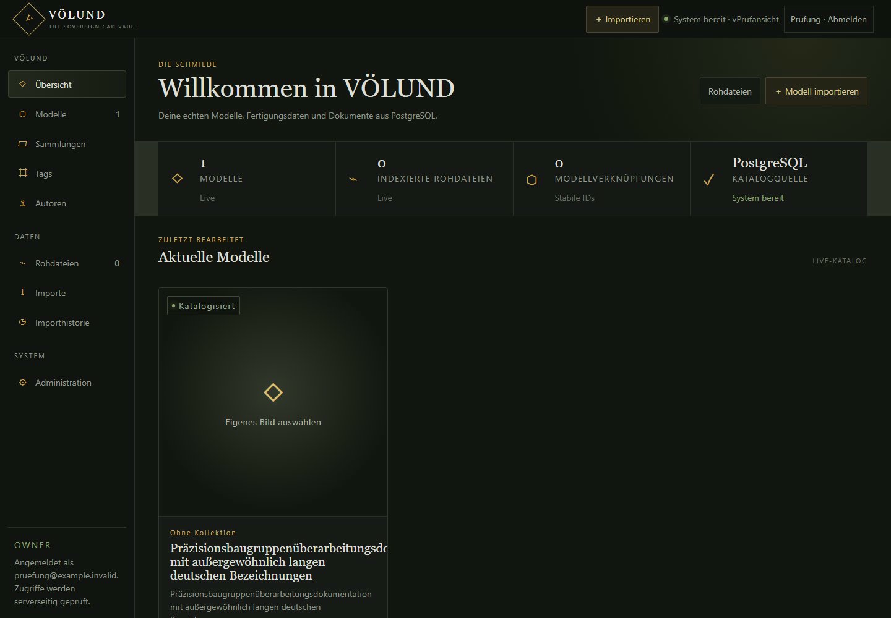
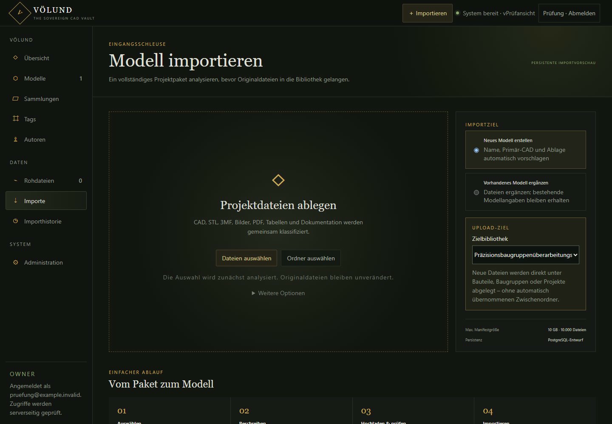
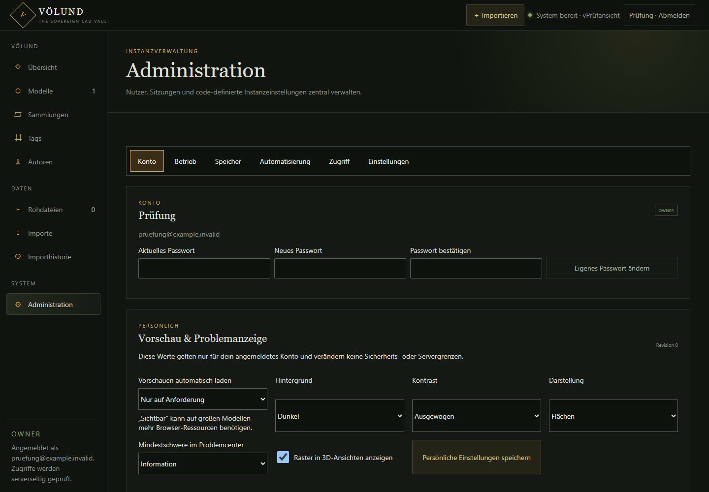

# VÖLUND

**The sovereign CAD vault.**

Current source version: **0.39.0**, with further work recorded under
`Unreleased`. VÖLUND is a pre-1.0 alpha technical foundation and design
prototype, not a product-complete catalog or an unattended-production release.
See the
[`product contract`](docs/PRODUCT_CONTRACT.md), [`CHANGELOG.md`](CHANGELOG.md), and
[`CONTRIBUTING.md`](CONTRIBUTING.md).

VÖLUND is a native, self-hosted CAD archive focused on durable ownership of
engineering files and reliable CAD assembly inspection. A complete exit path is
a product requirement; the full metadata/model export is not implemented yet.

The source filesystem remains authoritative. VÖLUND indexes originals in place,
stores user metadata separately, and treats previews as disposable derivatives.

## Einblicke

Die Aufnahmen zeigen die echte Browseroberfläche mit ausschließlich
synthetischen Beispieldaten; sie enthalten keine Produktions- oder CAD-Daten.







## Non-negotiable principles

- Original CAD files are never renamed, moved, or modified by an indexing run;
  only an explicit audited user move may change their path.
- Every original is identified and verified with a cryptographic content hash.
- Generated meshes, thumbnails, and search indexes can be rebuilt from originals.
- User-created metadata must gain a documented, machine-readable full export
  before the product can claim a complete exit path.
- Database changes use versioned migrations; production never uses schema push.
- CAD conversion runs out of process with time and memory limits.
- Native Linux installation uses system packages, systemd, and no containers.

## Architecture

```text
CAD library (read-only pipeline; controlled user moves)
        |
        v
volundd (Rust) ---> PostgreSQL
        |
        +--------> cad-convert (C++ / OpenCascade)
                         |
                         +--> preview.glb
                         +--> assembly.json
                         +--> diagnostics.json
```

The browser application uses framework-free TypeScript and Three.js. Its static
production build is served by `volundd`, so the native LXC runtime needs neither
Node.js nor a separate web server.

## Repository layout

```text
apps/volundd/          Rust daemon and job orchestration
apps/volund-web/       TypeScript catalog and Three.js viewer
crates/volund-core/    Stable domain and process-contract types
native/cad-convert/    Isolated native OCCT converter
contracts/             Versioned wire-format schemas
docs/adr/              Architecture decision records
deploy/systemd/        Native Linux service units
```

## Implemented technical foundation

The capabilities below describe shipped technical work, not a complete product
phase. Their honest workflow maturity and missing dependencies are tracked in
the [product contract](docs/PRODUCT_CONTRACT.md).

The native worker imports STEP, IGES, BREP, STL, 3MF, OBJ, PLY, glTF, and GLB,
then produces a GLB preview plus a loss-aware assembly
manifest that preserves definitions, repeated instances, names, transforms,
colors, source hashes, and diagnostics. Its complete nine-format fixture matrix
is exercised end to end on the target Debian LXC.

The Rust job runner serializes native conversions with a crash-safe filesystem
lock, enforces per-job timeouts, selects scale-adaptive `web` or `fine` previews,
and atomically publishes completed and failed job directories. See
[`apps/volundd/README.md`](apps/volundd/README.md) for the job lifecycle.

PostgreSQL persistence now separates content-addressed bytes from physical
library paths and records scan history, sidecar dependencies, conversion runs,
derived artifacts, logical models, metadata relationships, and import drafts.
Schema changes are explicit, immutable SQLx migrations; production startup
never mutates the database implicitly.

The read-only library scanner recursively indexes every regular project file
and classifies supported STEP, IGES, BREP, STL, 3MF, OBJ, PLY, glTF, and GLB
content for CAD conversion. Incremental scans reuse unchanged observations;
`--full` verifies every file again. Symlinks are deliberately skipped,
identical bytes share one content object, and vanished paths remain recorded as
missing rather than being deleted.

```bash
volundd register-root --key cad --name "CAD Library" --path /srv/volund/library
volundd scan --root cad
volundd scan --root cad --full
```

The versioned catalog API exposes health, roots, virtual folders, files,
content identities, scan history, and controlled same-library moves without
leaking host mount paths. Folder
navigation, recursive search, format filtering, sorting, and pagination execute
in PostgreSQL so the browser remains bounded for large catalogs. It listens only on
`127.0.0.1:8080` by default and is described by
[`contracts/http-api-v1.openapi.yaml`](contracts/http-api-v1.openapi.yaml).

```bash
volundd serve
curl http://127.0.0.1:8080/api/v1/health
```

Preview requests persist in PostgreSQL and are processed by a bounded native
systemd worker. Before conversion, the worker verifies that a source still
matches its indexed SHA-256; completed GLB and JSON artifacts are hashed and
published atomically in the catalog.

Ready GLB and JSON artifacts are exposed as immutable, SHA-256-tagged HTTP
streams with byte-range support, without revealing derived filesystem paths.

The browser UI preserves its current root, folder, search, filter, sort, page,
and selected file in the URL. It exposes file and preview metadata and opens
ready GLB previews in an interactive Three.js viewer. It also offers an audited
move dialog whose destination browser is loaded lazily. The UI is delivered
from the same origin as the API.

The import page accepts complete file or directory selections, validates paths
and limits, proposes metadata and a deterministic target layout, then streams
every file into isolated staging. Confirmation revalidates hashes and conflicts,
atomically publishes the project, preserves existing source UUIDs and registers
all CAD, mesh, document, image, archive and sidecar files with the model.

```powershell
cargo test --workspace
cargo run -p volundd -- doctor
```

The native converter is built and tested in the target Linux LXC because it links
against the distribution's OpenCascade packages. See
[`native/cad-convert/README.md`](native/cad-convert/README.md) for its CLI and
artifact contract.

## Native data layout

The target LXC keeps the application on its system disk and persistent data on
the dedicated `/srv/volund` mount:

```text
/srv/volund/library/    authoritative CAD originals
/srv/volund/derived/    rebuildable previews and extracted metadata
/srv/volund/scratch/    bounded converter work area
/srv/volund/exports/    portable metadata and library exports
/srv/volund/backups/    database and configuration backups
/srv/volund/postgres/   PostgreSQL cluster data
```

## Installation, support, and security

- [`INSTALLATION.md`](INSTALLATION.md) defines the current manual source-build
  installation contract and links to the canonical Debian procedure.
- [`SUPPORT.md`](SUPPORT.md) lists validated platforms, browsers, formats, and
  known limitations.
- [`SECURITY.md`](SECURITY.md) explains private vulnerability reporting,
  maintenance scope, and security boundaries.

## Lizenz

VÖLUND steht unter der GNU Affero General Public License, ausschließlich
Version 3 (`AGPL-3.0-only`); siehe [LICENSE](LICENSE). Dies gilt für den eigenen
Rust-, Web- und C++-Code sowie die eigenen Skripte und Dokumente, soweit eine
Datei keine abweichenden Rechte nennt. VÖLUND wird ohne Gewährleistung im
Umfang der Lizenz bereitgestellt.

Drittanbieter behalten ihre eigenen Lizenzen; siehe
[THIRD_PARTY_NOTICES.md](THIRD_PARTY_NOTICES.md). Eigene CAD-Dateien und
Katalogdaten werden durch die Verwendung von VÖLUND nicht automatisch unter
die AGPL gestellt. Hinweise zur Weitergabe und zum Quellcodeangebot stehen in
[docs/licensing/README.md](docs/licensing/README.md).

Dieser öffentliche Quellsnapshot enthält bewusst weder die frühere
Repository-Historie noch interne Betriebs- und Abnahmenachweise.
